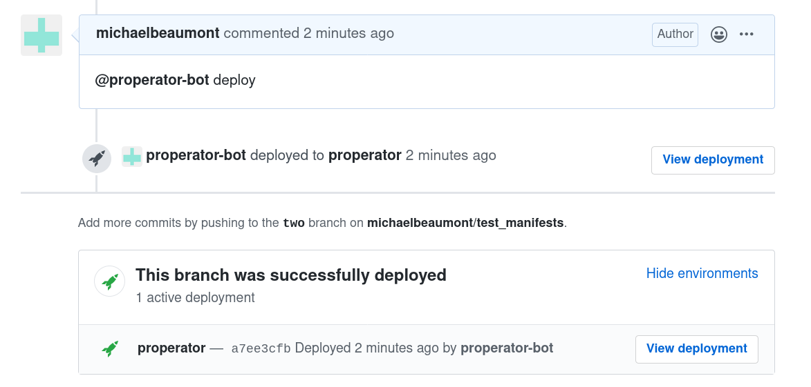
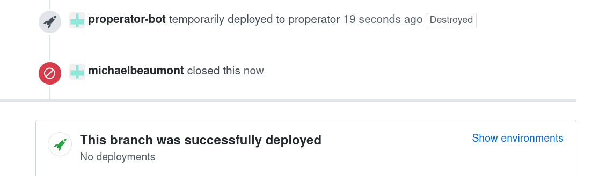

# properator

properator manages launching _in progress_ versions of your application using Flux,
pull requests and the Github deployments API.

Note: `properator` is only setup for local testing at the moment.

## Usage

Assuming `properator` is setup to listen to your repository's webhook events
(see below) and running as `@properator-bot`.
If we comment `@properator-bot deploy` on an existing PR, `properator` will launch
an instance of Flux
pointed to that PR's branch and create a GH deployment to track it.



When the PR is closed, that instance of Flux and the launched manifests will disappear.



### URL annotations

Include annotations like the following on an `Ingress` resource:

```
metadata:
  annotations:
    deploy.properator.io/deployment: github-webhook # This should always be `github-webhook`
    deploy.properator.io/url: https://2.pr.app.test # This should point to your deployment
```

to have the GH deployment point to `https://2.pr.app.test`.

#### Generation

Note: `properator` gives you access to the PR number
when manifests are generated on the file system at `/etc/properator`.

As a primitive example, this means you can have a `.flux.yaml` like:

```
.flux.yaml
---
version: 1
patchUpdated:
  generators:
  - command: sed -e "s/\${PR}/$(cat /etc/properator/pr)/g" ingress.yaml

ingress.yaml
---
apiVersion: extensions/v1beta1
kind: Ingress
metadata:
  name: my-app
  annotations:
    deploy.properator.io/deployment: github-webhook
    deploy.properator.io/url: http://${PR}.pr.app.test
```

## Setup

We're assuming `minikube` running locally.

### Deploy key

Setup a deploy key in your cluster that will be shared by `flux` instances to access the repository.

```
kubectl create ns properator-system
kubectl create secret generic -n properator-system flux-git-deploy --from-file=identity
```

where `identity` is a file containing a private SSH key. The public half should
be added as a deploy key in Github for each repo setup with `properator`.

### Github credentials

The controller needs:

- a token giving access to a github user account.
- to listen to github webhook events and forward them to the
  `properator-system/github-controller-manager` service.
  Make note of the webhook secret.

For testing, you can use `make listen-webhook` to use `smee.io` to proxy events
from your local machine to your cluster.

Put both of these secrets into the `.env` file in the root of the repo:

```
GITHUB_TOKEN=<github_token>
GITHUB_WEBHOOK_SECRET=<webhook_secret>
```

### Launch

At the moment, the images needs to be built manually and they need to end up
accessible by the cluster. For example, using `eval $(minikube docker-env)`,
execute:

```
make docker-build
```

Install the manifests to the cluster with:

```
make deploy
```

## TODO

1. Add configuration to repositories
   - `--git-path` for `flux`
1. How to measure "successful" deployment
   Right now it's just whether an `Ingress` resource appears with a link to the
   deployment.
   - If we're not using `Ingress`?
   - Maybe have image for use in k8s `Job` which sets the deployment as active if
     an ingress is _really_ responsive?
1. Make deployment to cluster easier, github apps
